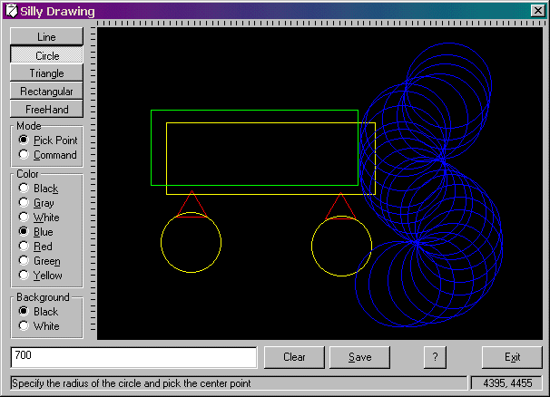



## Silly Drawing Tool

### Description

Make shapes with this code.

You can choose: color, shape, background; save your drawing, and more...

I say it is silly, but you may not.
 
### More Info
 

             |
---                |---
**Submitted On**   |2003-07-22 18:09:04
**By**             |[Waleed Nassef](https://github.com/Planet-Source-Code/PSCIndex/blob/master/ByAuthor/waleed-nassef.md)
**Level**          |Intermediate
**User Rating**    |5.0 (10 globes from 2 users)
**Compatibility**  |VB 5\.0
**Category**       |[Graphics](https://github.com/Planet-Source-Code/PSCIndex/blob/master/ByCategory/graphics__1-46.md)
**World**          |[Visual Basic](https://github.com/Planet-Source-Code/PSCIndex/blob/master/ByWorld/visual-basic.md)
**Archive File**   |[Silly\_Draw1619217232003\.zip](https://github.com/Planet-Source-Code/waleed-nassef-silly-drawing-tool__1-47125/archive/master.zip)

